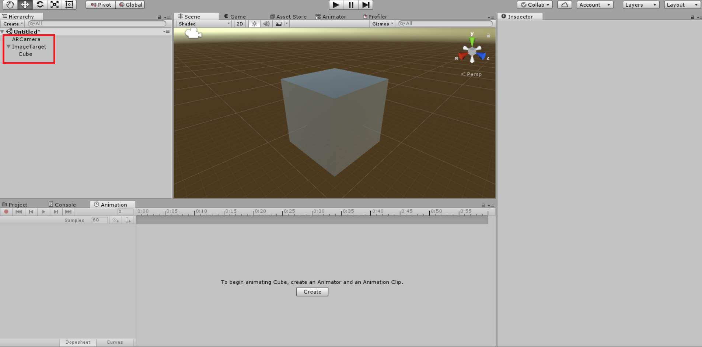

# Creating Basic AR Game with Unity

## Prerequisites

To simplify augmented reality game creation, first of all, you need to choose game development platform and augmented reality SDK (software development kit). 

Game development platform reduces amount of work needed to be done in performing basic game developming tasks. For this tutorial Unity was chosen (https://unity3d.com/). It is the most popular game development engine which is also quite easy to use.

Augmented reality SDK is used for objects tracking and recognition. It enables computers to see and understand more in the environment around them. This tutorial does not concentrate on any specific AR platform as most of them contains similar features. Reader is free to choose most suitable platform for his/her needs, although, it should be compatible with Unity. The most popular augmented reality SDK's are:
* Vuforia
* EasyAR
* Kudan
* Wikitude
* ARToolkit (open-source)

Moreover, if you want to make game available for android devices, you should install Java JDK and Android SDK. For installation instructions check out software official web pages.

## First AR Scene in Unity

When required software is installed you can create your first AR game scene. First of all, create new project in Unity and add empty scene. Import your augmented reality SDK as Unity Asset. It should import all necessary objects for simple AR game scene implementation. In Unity they should be called Prefabs. 

Every AR game scene should consist of two objects: AR camera and image targets. Drag those objects from your augmented reality asset to created scene. Select image target and choose image you want to recognize. Every augmented reality SDK has different means of uploading image to unity prefabs. You should check your augmented reality SDK vendor for more information. 

Lastly, create new 3D object (simple cube would be enough) and drag it as image target child (every object that is image target child will be only rendered if image target is identified). Save created scene and play AR game. 

Position camera in front of the image target and enjoy exploring visualized 3D model! That is all you need to do to create simple AR scene.

