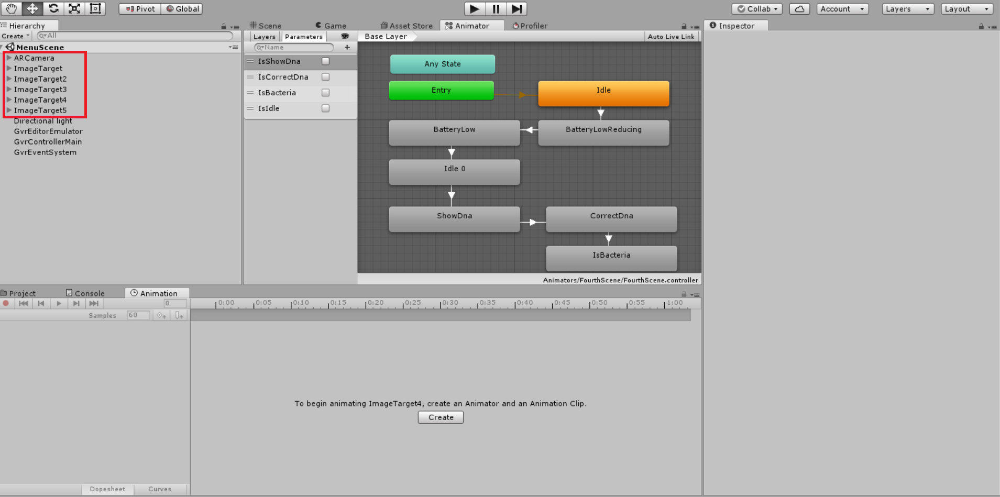
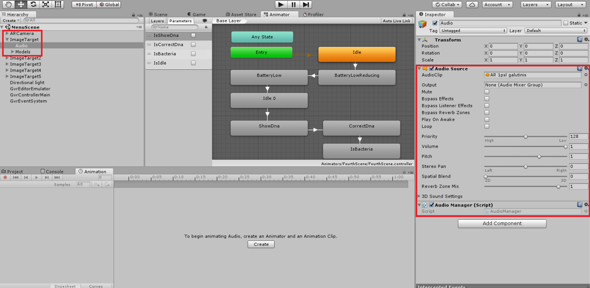
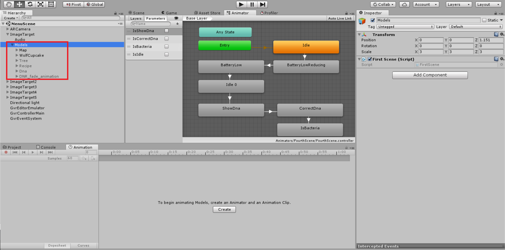
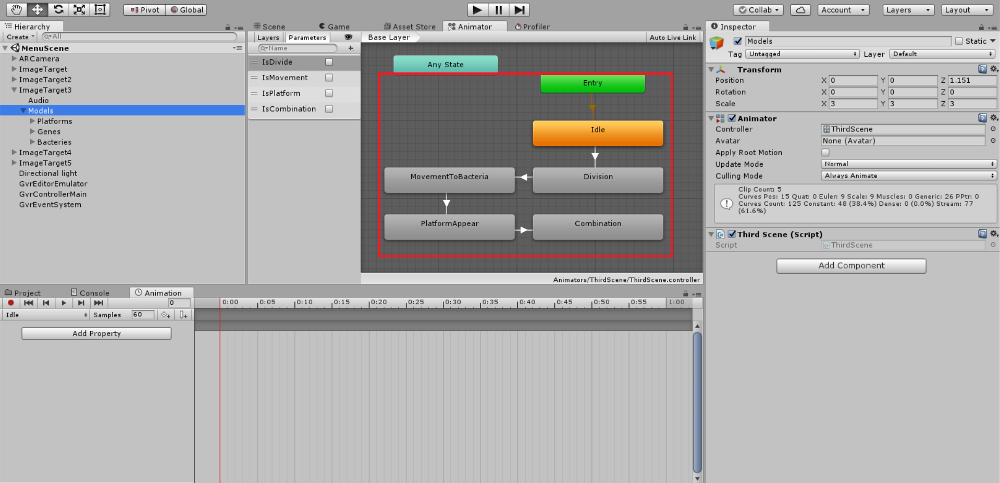
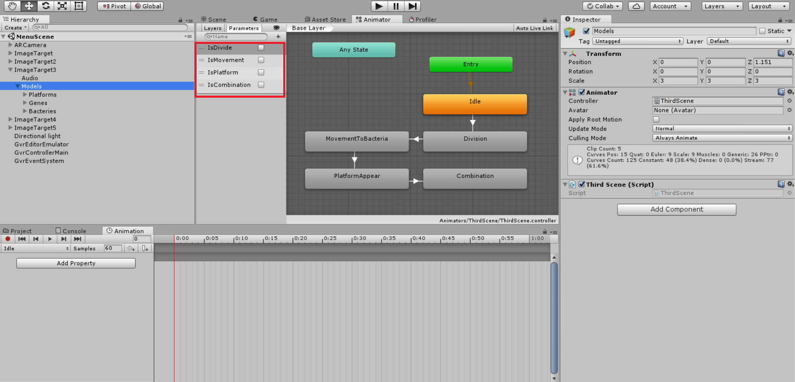
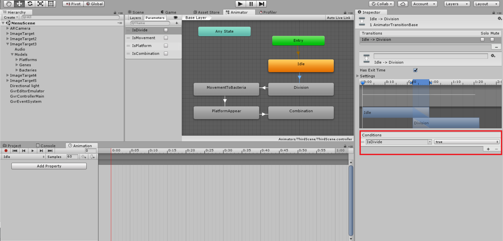
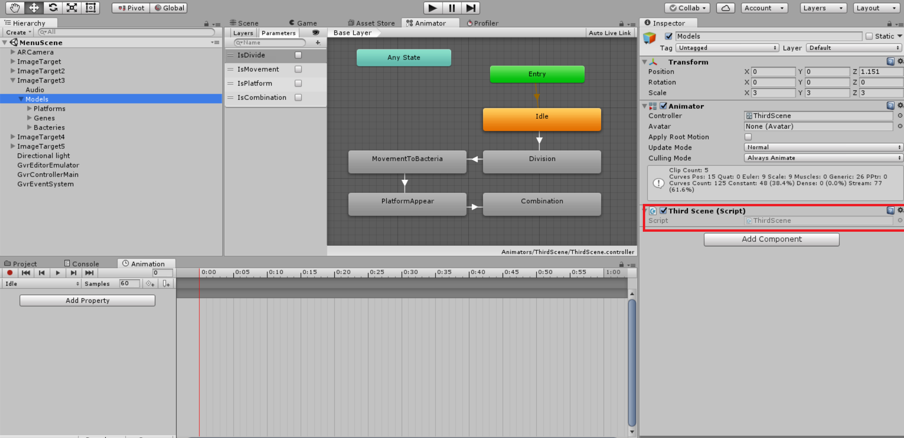
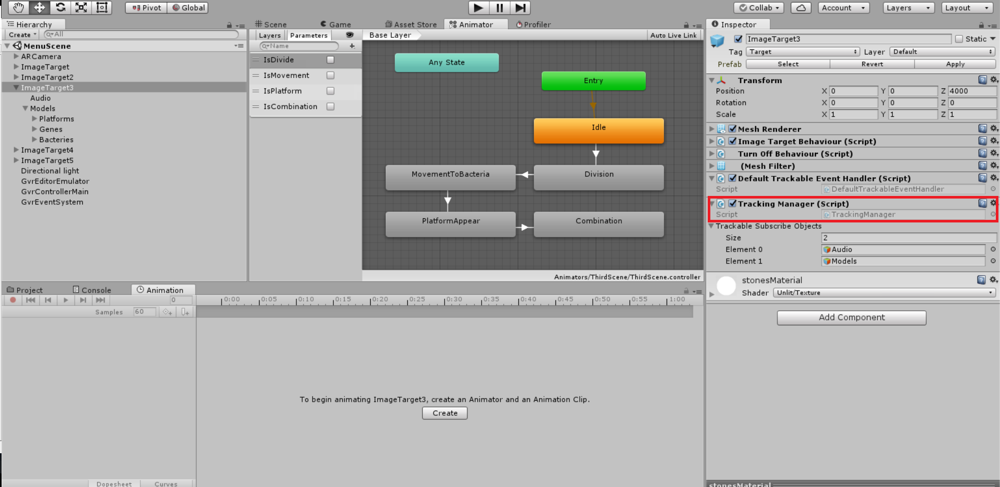
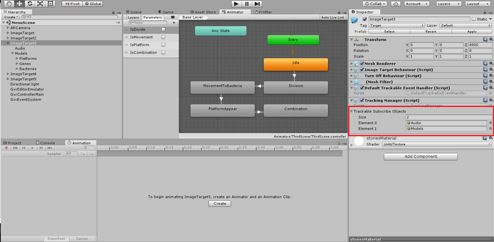

# Educational Aspects of AR Game - Implementation

This section requires knowledge from previous documentation segments, so be sure that you have already read "1. Creating Basic AR Game with Unity" and "2. Educational Aspects of AR Game". In this part we simply improve basic AR game that was created in the first section.  In this stage your Unity game hierarchy should look like this (add more image targets if you want recognize more textures and show more content).



As mentioned in the second section image target content consists of four main objects: audio tracks, 3D models, animations and interactive content. In this section we will implement only first three of them.

## Audio

Using Unity create new empty game object, drag it as ImageTarget child and name it Audio. This will be the object to upload your audio tracks. To do that, simply navigate to inspector tab (right side of the window) and click "Add Component". Choose audio source and new component will be uploaded to empty game object. In the AudioClip section drag your own audio file and that is it! Your audio would be played as soon as the game starts. But this is not expected behaviuor as we only want to start audio when specific image target is recognized. To do that simply drag our AudioManager script (available in this repository folder Scripts) into audio game object. At this time your audio gameObject should look like this



## 3D Models

Using Unity create new empty game object, drag it as image target child and name it Models. In this game object you should import your own 3D models as show in the example.



## Animations

Simpliest way to create animations is to use Unity built-in animation mechanism. First of all, create new animator object and drag it to Models game object that was created earlier. It creates animation manager that controls flow of animations.


Also, create several animations and drag them to animator window (if you do not know how to create animations in Unity check the information in Unity website). To control flow of the animations make transitions for all of them in the order that they should appear in the scene. At this point your animator window should look like this



To control the transitions between animations parameters should be created and named after animation that it is pointing to. 



Assign each created parameter to the transition condition. It simply says that new animation will only be played when specific parameter will have correct value. These parameters values will be controled and changed in the scripts.



## Putting Everything Together

As for this point, we have audio and animations that will be played as soon as image target is recognized. Nonetheless, this often is not the desired behaviour. We want to play specific audio tracks and animations at specific time. 

For this you must create script that will control the flow of your game correctly. We created scripts that will make it easier for you, nevertheless, the main control script should be written and maintained by the reader himself. To see the example of it open (Sripts/ExampleFlow.cs) script. Now, we will look into each segment of the script to understand it more clearly. After this you should be able to write one by yourself.

First of all script starts with declaration of the class. 

```
public class FirstScene : MonoBehaviour, ITrackableStateHandler
```

This is standard declaration of Unity c# class. Nevertheless, it implements ITrackableStateHandler interface which simply means that our class should know how to behave when our trackable object is lost or found. This is neccesary component of every flow managament script.

For now leave Start method aside as it will be the only one that needs to be modified by the reader. Now let's take a look at Update method. It takes care of updating every frame as well as playing animation at the right time. It also stops animating your objects when image target is not recognized.

```
void Update()
{
	if (!showAnimations)
		return;
	timeElapsed += Time.deltaTime;

	var animationsToUpdate = animations.Where(animation =>
		animation.GetStartTime() < timeElapsed &&
		(animation.GetEndTime() == null || animation.GetEndTime() > timeElapsed));

	if (animationsToUpdate.Count() == 0)
		return;

	animationsToUpdate.ToList().ForEach(animation => animation.Execute());

	var animationsToRemove = animations
		.Where(animation => animation.GetStartTime() < timeElapsed &&
		(animation.GetEndTime() == null || animation.GetEndTime() < timeElapsed));

	animationsToRemove.ToList().ForEach(animation => animations.Remove(animation));
}
``` 

The last two methods are responsible for the behaviour when trackable image is lost or found. Our solution was to only set parameter showAnimations value and all the proccessing leave in the Update method described above.

``` 
public void OnTrackableFound(GameObject gameObject)
{
	showAnimations = true;
}

public void OnTrackableLost(GameObject gameObject)
{
	showAnimations = false;
} 
``` 

Finally, let's get back to Start method. In Start method you should create list of animations (as well as audio or scripts) that should be played at the specific time. This is done by creating new AnimatorParameterSetter instance. This class simply sets value of animator parameter at specific time, so it is highly related to content that was build in Unity animator in the earlier steps. When creating AnimatorParameterSetter instance you should specify animator object (which by default is transform.GetComponent\<Animator\>() ), parameter name (specified in animator window), parameter value (default is true), time in seconds when parameter should be set and animation end time (optional, usually do not used). Look at Unity animator window and Start method below and you should now understand the relation between these two objects. Also, it should be clear when and what animations will appear.

```
void Start()
{
	animations = new List<IAnimationExecutor>();

	var division = new AnimatorParameterSetter<bool>(transform.GetComponent<Animator>(), "IsDivide", true, 8.0f, null);
	var movement = new AnimatorParameterSetter<bool>(transform.GetComponent<Animator>(), "IsMovement", true, 11.0f, null);
	var platform = new AnimatorParameterSetter<bool>(transform.GetComponent<Animator>(), "IsPlatform", true, 20.0f, null);
	var combination = new AnimatorParameterSetter<bool>(transform.GetComponent<Animator>(), "IsCombination", true, 25.0f, null);

	animations.Add(division);
	animations.Add(movement);
	animations.Add(platform);
	animations.Add(combination);
}
```

This is the only part in the script that you will need to change for basic cases, so be sure that you understand it correctly. Example below shows another script that ilustrates how the same things can be done with audio tracks. In this case we create AudioPlayer object instead of AnimatorParameterSetter. It takes parameters of audio source, start and end times.

```
void Start()
{
	animations = new List<IAnimationExecutor>();
	var audioSource1 = transform.parent.Find("Audio").GetComponents<AudioSource>()[1];
	var audioSource2 = transform.parent.Find("Audio").GetComponents<AudioSource>()[2];
	var audioSource3 = transform.parent.Find("Audio").GetComponents<AudioSource>()[3];

	var playAudio1 = new AudioPlayer(audioSource1, 15.0f, null);
	var idle = new AnimatorParameterSetter<bool>(transform.GetComponent<Animator>(), "IsIdle", true, 14.0f, null);
	var shwoDna = new AnimatorParameterSetter<bool>(transform.GetComponent<Animator>(), "IsShowDna", true, 17.0f, null);
	var playAudio2 = new AudioPlayer(audioSource2, 26.0f, null);
	var correctDna = new AnimatorParameterSetter<bool>(transform.GetComponent<Animator>(), "IsCorrectDna", true, 26.0f, null);
	var bacteriaFill = new AnimatorParameterSetter<bool>(transform.GetComponent<Animator>(), "IsBacteria", true, 36.0f, null);
	var playAudio3 = new AudioPlayer(audioSource3, 41.0f, null);
	
	animations.Add(idle);
	animations.Add(playAudio1);
	animations.Add(shwoDna);
	animations.Add(playAudio2);
	animations.Add(correctDna);
	animations.Add(bacteriaFill);
	animations.Add(playAudio3);
}
```

When finished editing your animation flow manager, drag this script as component in Models object.



If you want more specific examples of FlowControl scripts take a look at the files in Scripts/ExampleFlow folder.

## Responding to trackable object state changes

When creating AR game it is very important to correctly respond to trackable object states changes. All the animations and audio tracks should be stopped when trackable source is lost and resumed once it is found again. For this reason we created a script that helps to solve this problem (Scripts/TrackingManager). Place this script as component in imageTarget. 



Specify all the components that needs to be notfied when trackable source object state changes.



As implementation of the script is highly related to augmented reality SDK implementation details you should modify script by the information provided by AR SDK vendor. All you need to do is to ensure that method OnTrackableStateChanged will be executed at the correct time. Example implementation of this can be found below.


```
public void OnTrackableStateChanged( TrackableBehaviour.Status previousStatus, TrackableBehaviour.Status newStatus)
	{
	if (newStatus == TrackableBehaviour.Status.DETECTED ||
		newStatus == TrackableBehaviour.Status.TRACKED ||
		newStatus == TrackableBehaviour.Status.EXTENDED_TRACKED)
	{
		//Trigger Target Manager for Detecting Tracking Source Change
		ExecuteEvents.Execute<ITrackableStateHandler>(mainCamera, null,
				(x, y) => x.OnTrackableFound(gameObject));

		//Trigger Audio Manager and Animations for Stopping Activities
		foreach (var trackableSubscribeObject in trackableSubscribeObjects)
		{
			ExecuteEvents.Execute<ITrackableStateHandler>(trackableSubscribeObject, null, 
				(x, y) => x.OnTrackableFound(gameObject));
		}           
	}
	else
	{
		//Trigger Audio Manager and Animations for Stopping Activities
		foreach (var trackableSubscribeObject in trackableSubscribeObjects)
		{
			ExecuteEvents.Execute<ITrackableStateHandler>(trackableSubscribeObject, null,
				 (x, y) => x.OnTrackableLost(gameObject));
		}           
	}
}
```

That's it, after finishing the steps provided above you should be able to create perfectly functioning AR game.
